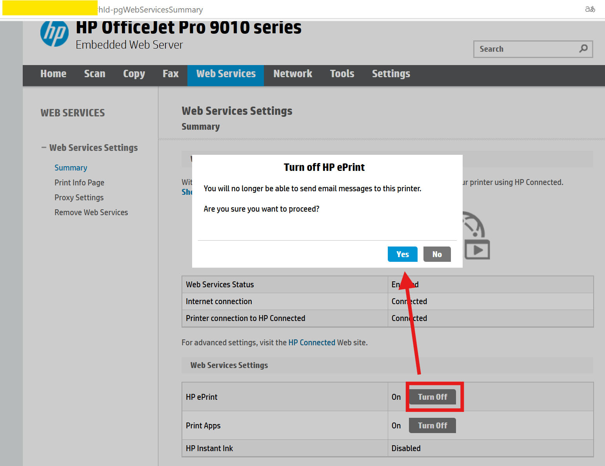
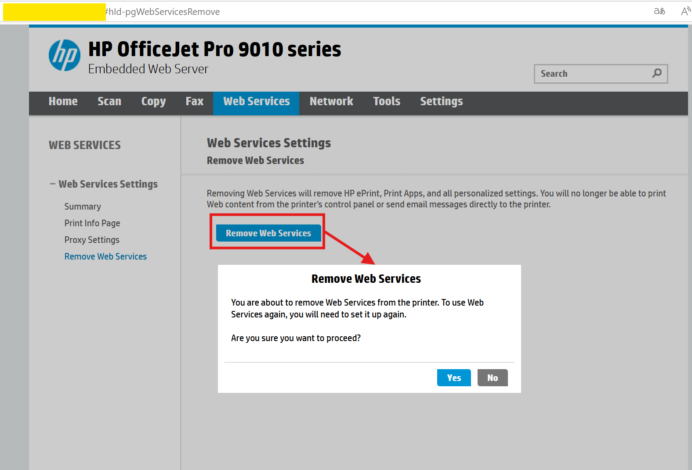
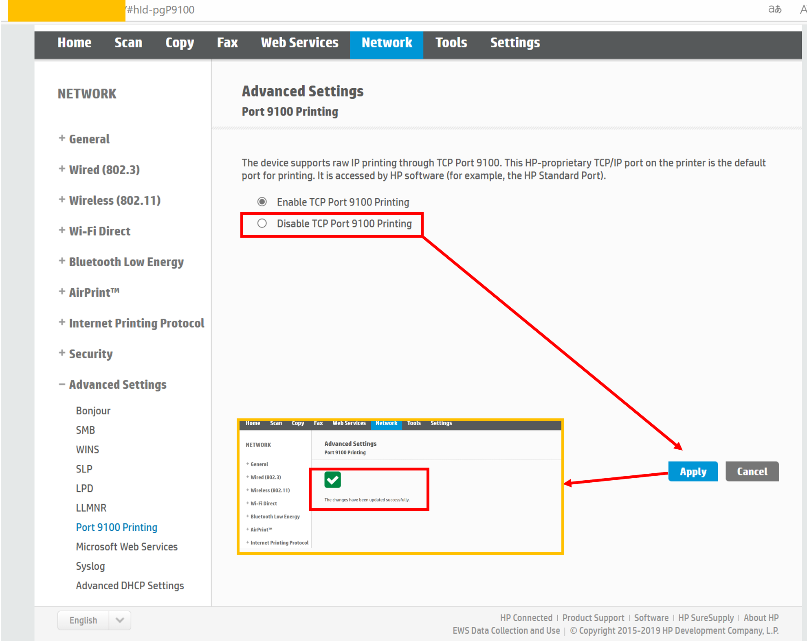
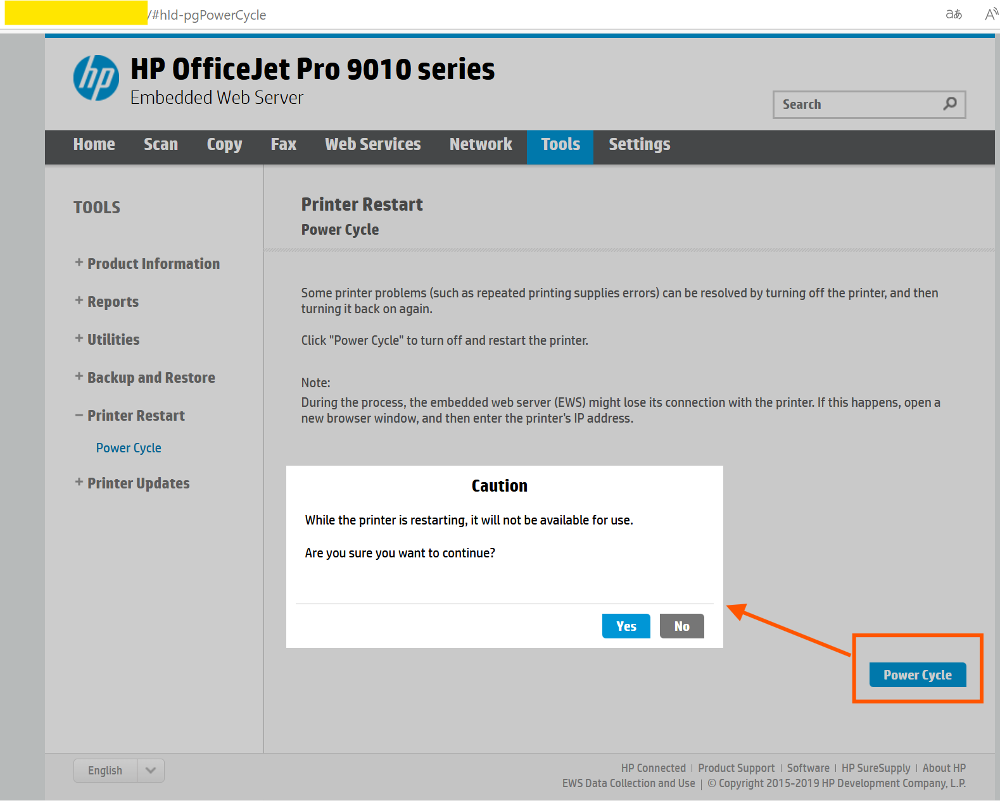
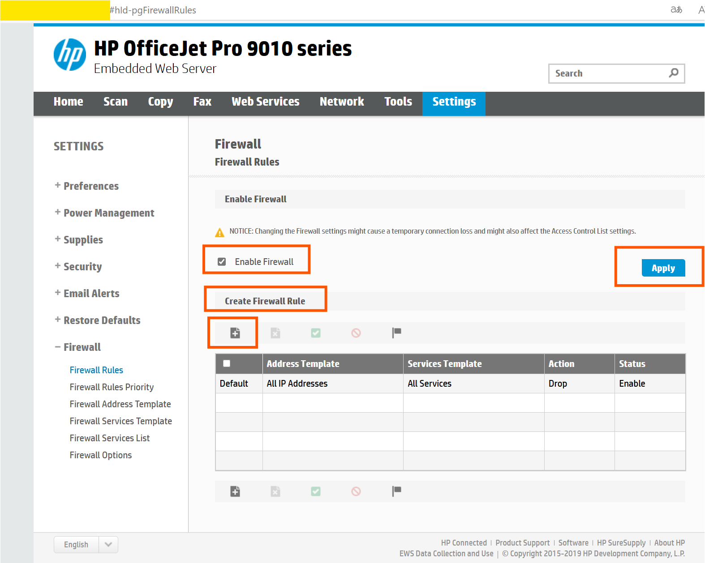
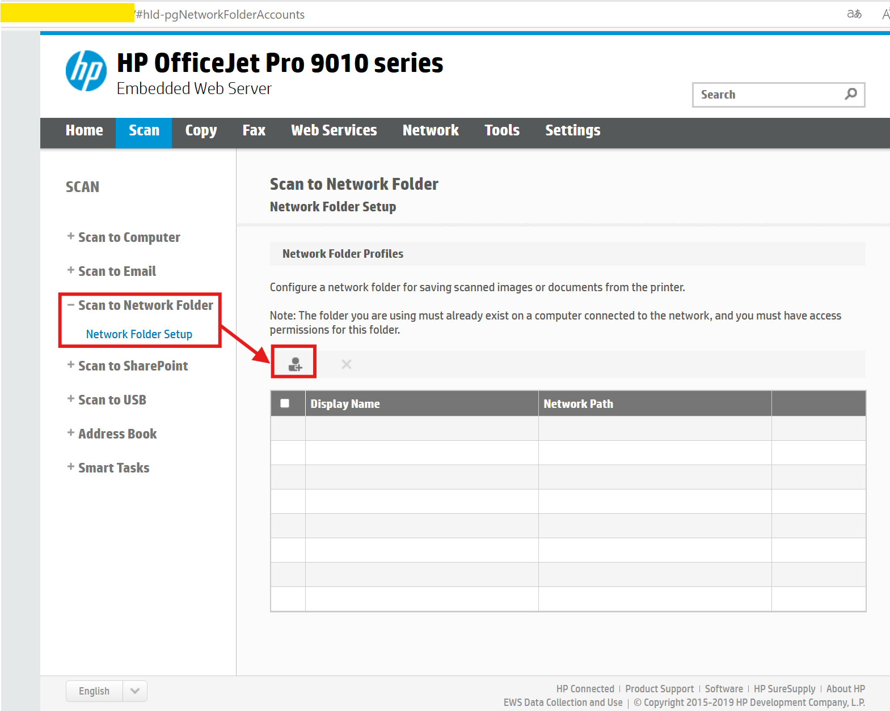

The HP OfficeJet Pro 9010 series printers have some network interfaces that do not require authentication. Attackers can remotely tamper with the printer configuration or directly manipulate the printer, such as:  
- disabling or deleting the printer's web services.
- closing the default port used for printing.
- restarting the printer.
- modifying firewall rules.
- setting up network folders or email accounts to send scanned or copied documents from the printer to the attacker.

